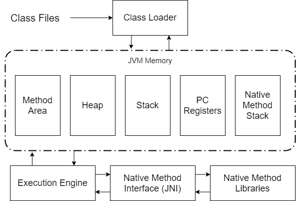
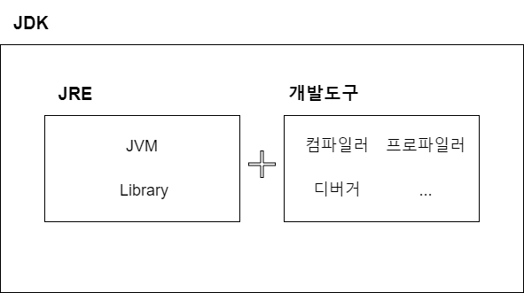

# JVM은 무엇이며 자바 코드는 어떻게 실행되는가

## JVM?
JVM(Java Virtual Machine)은 자바 바이트코드를 실행할 수 있는 주체이다. 일반적으로 인터프리터나 JIT 컴파일 방식으로 다른 컴퓨터 위에서 바이트코드를 실행할 수 있도록 구현되나 jop 자바 프로세서처럼 하드웨어와 소프트웨어를 혼합해 구현하는 경우도 있다. 

자바 바이트코드는 플랫폼에 독립적이며 모든 JVM은 JVM 규격에 정의된 대로 자바 바이트코드를 실행한다. 따라서 표준 JAVA API까지 동일한 동작을 하도록 구현한 상태에서는 모든 자바 프로그램은 CPU나 운영체제의 종류와 무관하게 동일하게 동작할 것을 보장한다. (Write once, run anywhere : 한번 작성하면, 어디에서나 실행된다.)


## 컴파일 하는 방법
JDK의 bin 디렉토리에 있는 자바 컴파일러(javac.exe)를 사용한다. 자바 소스코드(.java)를 바이트코드(.class)로 컴파일한다.
```java
$ javac Hello.java
```

## 실행하는 방법
JDK의 bin 디렉토리에 있는 자바 인터프리터(java.exe)를 사용한다. 컴파일러가 생성한 바이트코드를 생성하고 실행한다.

```java
$ java Hello
```

## 바이트코드?
바이트코드란 JVM이 이해할 수 있는 기계어다. (기계어 x, 가상 머신에 의해 기계어로 손쉽게 변환할 수 있는 코드) JVM은 바이트코드를 해당 OS의 기계어로 변환해 OS로 전달한다.


## JIT 컴파일러란 무엇이며 어떻게 동작하는지

JIT 컴파일러는 실행 시점에서 인터프리트 방식으로 기계어 코드를 생성하면서 그 코드를 캐싱하여, 같은 함수가 여러 번 불릴 때 매번 기계어 코드를 생성하는 것을 방지한다.

자바 컴파일러가 자바 프로그램 코드를 바이트 코드로 변환한 다음, 실제 바이트코드를 실행하는 시점에서 자바 가상 머신이 바이트코드를 JIT 컴파일을 통해 기계어로 변환한다.

JIT 컴파일러는 바이트코드를 읽어 빠른 속도로 기계어를 생성할 수 있다. 이런 기계어 변환은 코드가 실행되는 과정에서 실시간으로 일어나며(Just-In-Time), 전체 코드의 필요한 부분만 변환한다. 기계어로 변환된 코드는 캐시에 저장되기 때문에 재사용시 컴파일을 다시 할 필요가 없다. 

## JVM 구성 요소

> 참고 : Method Area와 Heap은 모든 스레드가 공유하는 영역이다. 

### Class Loader
- 실행 시에 필요한 클래스를 동적으로 메모리(Runtime Data Area)에 로드한다.

### Method Area
- 프로그램 실행 중 어떤 클래스가 사용되면, JVM은 해당 클래스의 클래스파일(.class)을 읽어서 분석해 클래스에 대한 정보(클래스 데이터)를 이 곳에 저장한다.
- JVM이 시작될 때 생성되는 공간으로 바이트코드가 이 영역에 저장된다.
- 클래스 정보, 변수 정보, static으로 선언한 변수가 저장되고 모든 스레드가 공유하는 영역이다.

### Heap
- new 연산으로 인해 동적으로 생성된 객체(인스턴스)가 저장되는 영역으로 GC의 대상이 되는 공간이다. 
- 프로그램 실행 중 생성되는 인스턴스는 모두 이 곳에 생성된다.

### Stack
- 지역변수나 메서드의 매개변수, 임시적으로 사용되는 변수, 메서드의 정보가 저장되는 영역이다.

### PC Registers
- 스레드가 시작될 때 생성되며, 현재 수행중인 JVM의 명령어 주소를 저장하는 공간이다. => 스레드가 어떤 부분을 어떤 명령어로 수행할지를 저장하는 공간

### Native Method Stack
- Java가 아닌 다른 언얼 작성된 코드를 위한 공간이다. 즉, JNI(Java Native interface)를 통해 호출하는 C/C++ 등의 코드를 수행하기 위한 공간이다.
- 쓰레드마다 하나씩 생성되는 공간이다.


### Excution Engine
- 로드된 클래스파일의 바이트코드를 실행하는 엔진

### Native Method Interface(JNI)
- JVM에 의해 실행되는 코드 중 네이티브로 실행하는 것이 있다면 해당 네이티브 코드를 호출하거나 호출될 수 있도록 만든 일종의 프레임워크

### Native Method Libraries
- 네이티브 메소드 실행에 필요한 라이브러리

## JDK와 JRE의 차이


### JDK(Java Development Kit) 
- 자바개발도구
- JRE + 개발에 필요한 실행파일(javac.exe 등)

### JRE(Java Runtime Environment)
-  자바실행환경
-  자바로 작성된 응용프로그램이 실행하기 위한 최소환경
-  JVM + 클래스 라이브러리(JAVA API)


# 참고자료
- [JIT 컴파일러](https://ko.wikipedia.org/wiki/JIT_%EC%BB%B4%ED%8C%8C%EC%9D%BC)
- 자바의 정석